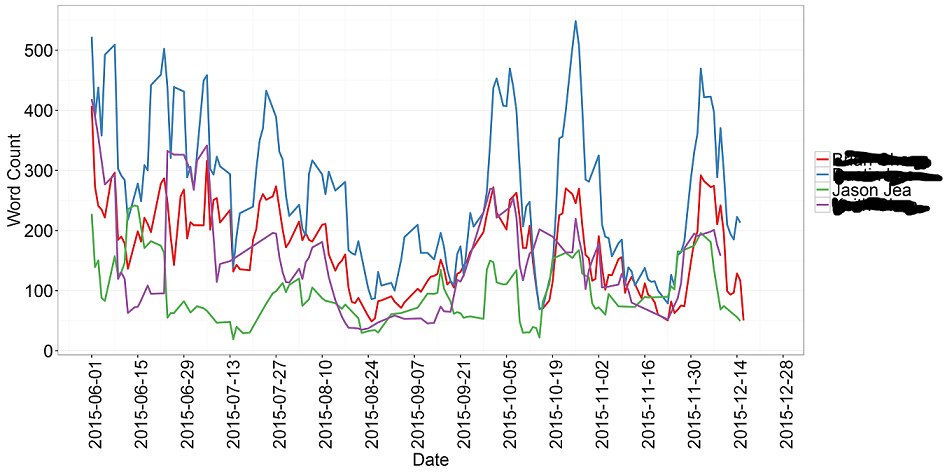
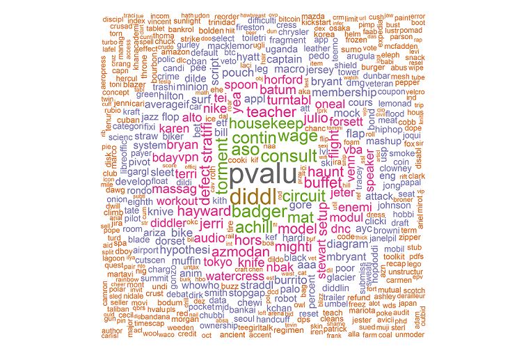

## Text Mining Your Google Hangouts

The American Dream: buying a house, owning a car, and being able to systematically and efficiently overanalyze your instant messages.


## Will Google help me?

- yes
- gives you a bunch of compressed jsons


## What tool are we using?

- R
why?
- excellent universe of text mining, data cleaning, visualization, and modeling libraries
- visuals look nicer than Python (debateable)
- I can email package authors and get a response


## What libraries do I need

- **jsonlite**: converts json into list structure (R specific)
- **plyr and dplyr**: data cleaning and manipulation, extremely fast, readable, and parallelizable
- **ggplot2**: 100% necessary visualization package
- **tm, RTextTools, wordcloud**: converting data into corpi, document term matrices, etc.
- **glmnet, randomForest, cluster, HSAUR**: ML algos
- **lubridate, scales, zoo, Matrix**: will make life easier


## JSON file

```{r, eval=FALSE}
hangouts.json <- fromJSON(txt = "Hangouts.json", flatten = TRUE)
```

<div class="columns-2">


## Parsing the JSON file: technicalities

- high level language with many functions wrapped around C code


- for loops are inefficient as a result


- solution: vectorize your functions (**plyr** is great package for this)

```{r, eval = FALSE}
llply(hangouts.json[[2]]$conversation_state.event, function(x) {
  
  data.frame(cbind(
    text = laply(x$chat_message.message_content.segment, function(y) {
          
      text <- ifelse(length(y$text) == 0,"", y$text)
      
      }, .progress = "text"),
        timestamp = x$timestamp,
        gaiai_id = x$sender_id.gaia_id
      ))
    
  }, .progress = "text")
```


## Table Structure

```{r, echo=FALSE}
temp <- hangout.data
temp$text <- substr(hangout.data$text, start =0 ,stop = 30)
temp$fallback_name <- "Bob McBob"

head(temp[,c("text","timestamp","fallback_name")])
```


## Text Mining Basics

- Corpus: a collection of documents

- Bag of words model: every document is a set of all its words (we don't care about grammar)

- Stemming: mapping words to their root form

- Document-term matrix: matrix representation of text, many weighting schemes

- R libraries can handle all of the cleaning and prepartion of your textual data

```{r, eval = FALSE}
hangoutCorpus.summary <- Corpus(DataframeSource(data.frame(hangout.summary$text)))
hangoutCorpus.summary <- tm_map(hangoutCorpus.summary, stripWhitespace)
hangoutCorpus.summary <- tm_map(hangoutCorpus.summary, removePunctuation)
hangoutCorpus.summary <- tm_map(hangoutCorpus.summary, tolower)
hangoutCorpus.summary <- tm_map(hangoutCorpus.summary, removeWords, stopwords("english"))
hangoutCorpus.summary <- tm_map(hangoutCorpus.summary, stemDocument,language="english")
```

## What can we look at?
- Word counts trended




## How about wordclouds?

- **wordcloud** package: one vector of words, one vector of weights (can be anything)



## Author prediction

- we can fit a LASSO multinomial regression to try and the author of a message
- I like LASSO over randomForests or SVM's because of coefficient interpertability 

```{r, eval=FALSE}
hangout.model <- cv.glmnet(hangout.full.matrix,
                           factor(hangout.summary$participant), family = "multinomial")
```

- coefficient extraction is a little annoying, requires some vectorized functions
```{r, echo=FALSE}
temp <- betas
temp$participant <- "Space X"
head(temp)
```


## Unsupervised classification
- k-means clustering easiest algorithm to implement
- visualizing clusters is tricky (silhouette plot for multidemnsional, pair plots for 2 dimensions)
- can also find most important words for each cluster

```{r, echo=FALSE}
for (i in 1:c(2, 7, 6)) {    
  inGroup <- which(kmeans.results$cluster==i)     #For each cluster, this defines the documents in that cluster
  within <- hangout.full.matrix[inGroup,]            
  if(length(inGroup)==1) within <- t(as.matrix(within)) #This is a formatting correction when there is only one doc in a cluster
  out <- hangout.full.matrix[-inGroup,]              
  words <- apply(within,2,mean) - apply(out,2,mean) #Take the difference in means for each term
  print(c("Cluster", i), quote=F)
  labels <- order(words, decreasing=T)[1:10] #Take the top 20 Labels
  print(names(words)[labels], quote=F)     #From here down just labels
  if(i==length(kmeans.results$withinss)) { 
    print("Cluster Membership")
    print(table(kmeans.results$cluster))
    print("Within cluster sum of squares by cluster")
    print(kmeans.results$withinss)
  }
}
```

## What else can we do?

- sentiment analysis: download sentiment lexicon, map to corpus, run classification algo (naive bayes)
- time series analysis: can we predict word counts by time of day, day of week, date, etc.?
- chat search engine: input a query string, return the chats that are most similar to query


